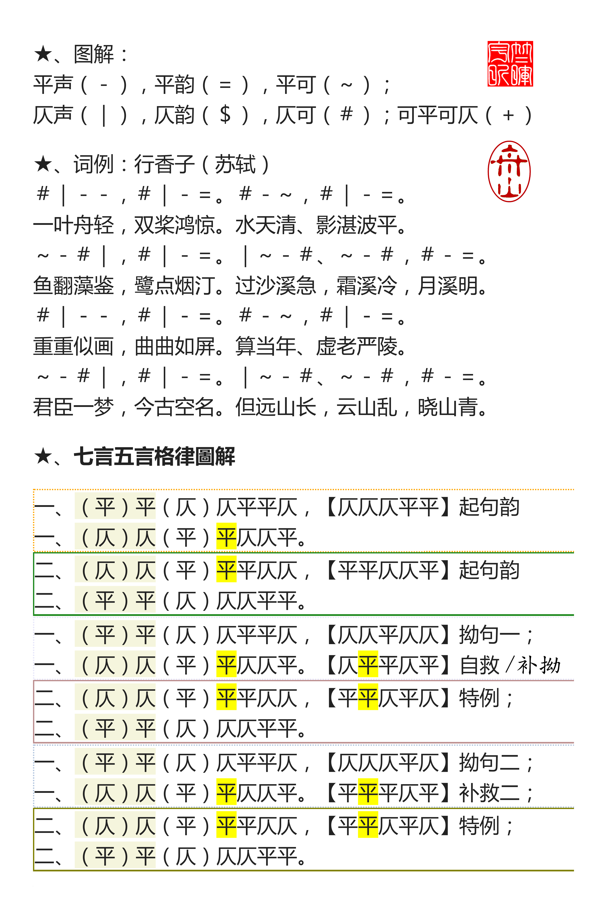

# 律韻合編

> 備選格律工具、詩詞輯集、及韻文古卷於一隅。

 
## 總目

* 電子書籍・[&#128218;](./books)
  - [龙榆生《近三百年名家词选》](./books/龙榆生-近三百年名家词选.epub)
  - [王力《诗词格律》](./books/王力-诗词格律.epub)（增订本）
  - [平水韻表.doc](./books/平水韵表.doc)｜[pdf](./books/平水韵表.pdf)
  - [词林正韵](./books/词林正韵.pdf)

* 舟山[詩詞](./shiji.html)｜[图片](https://photos.app.goo.gl/9t369STJZRnp9cD72)｜[图表](blog/data/README.md)

* 纱糸轩[歌词集](./lyrics.html)｜[翻唱全集](blog/songs.md) (Chinese ⇌ English lyrics)

* 读书[笔记＋杂抄](./blog/README.md)

* 圖書[附錄](./gelv/README.md)

  

&raquo; Back to <a href="#toc">Contents</a> ｜ <a href="https://dockerian.github.io">Home</a>

<!--stylesheet-->

