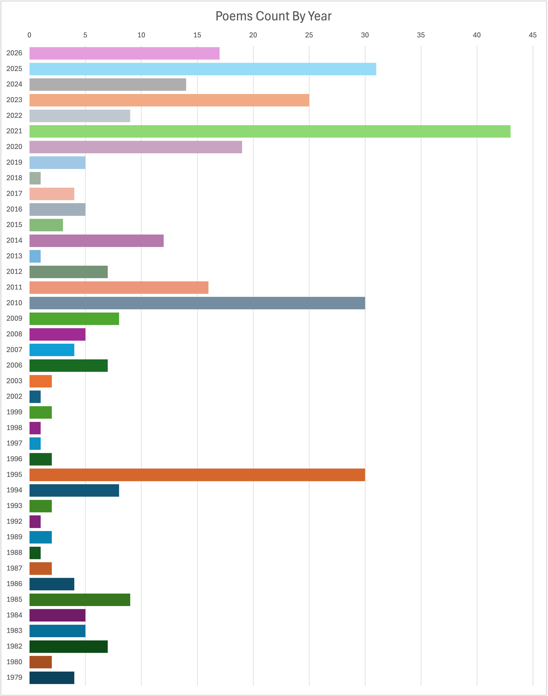
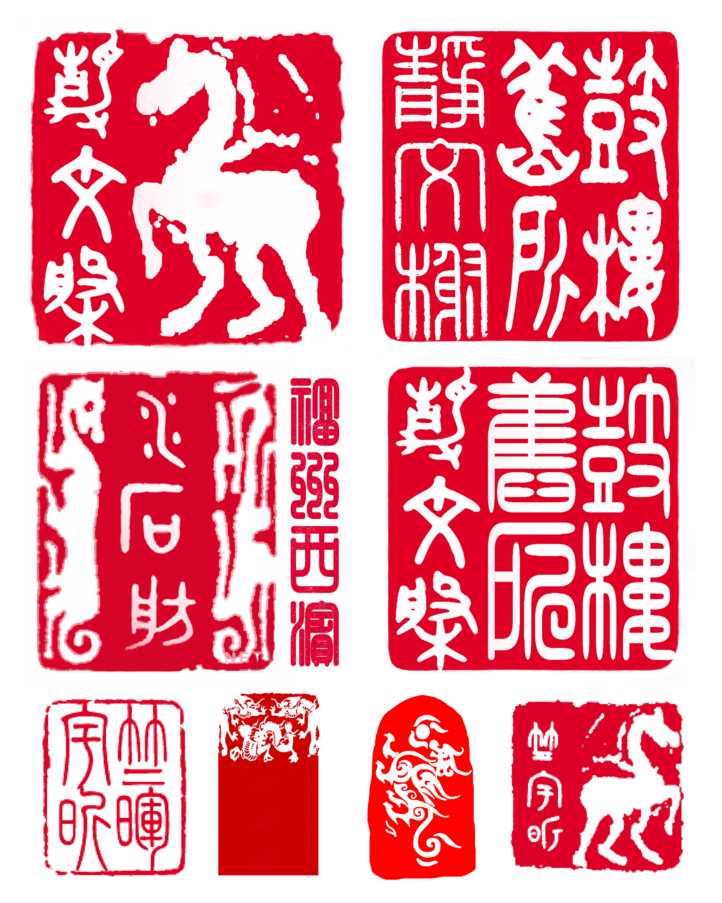
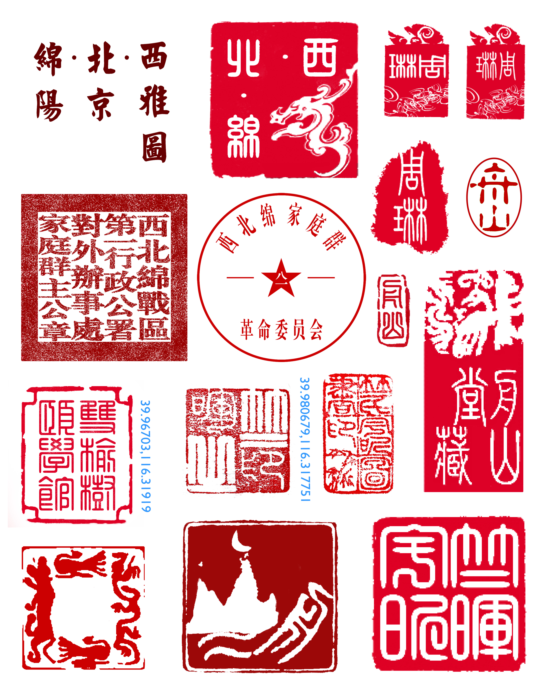
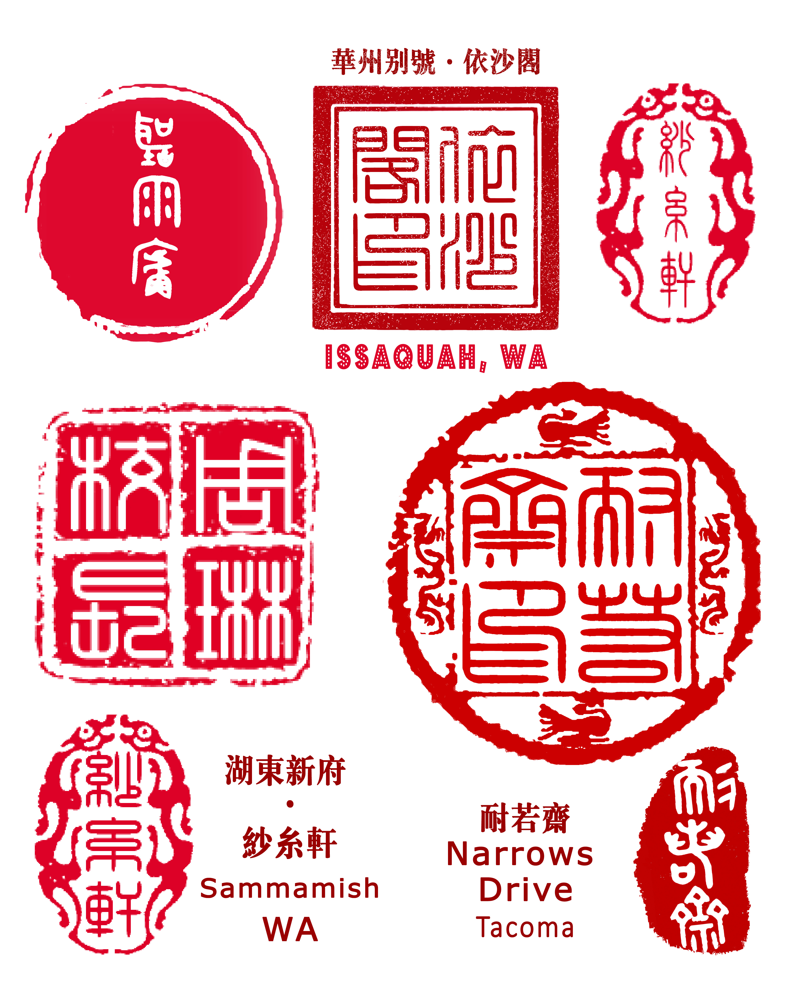

# 博客数据 

> 信息＋数据：[别号年代](#alias)＋诗稿统计表格、图片

### 舟山诗稿历史数据

* 表格文件〔下载〕：[shiji.xlsx](shiji.xlsx)｜[shiji.xls](shiji.xls) (Excel 97~2004 format)

&raquo; [More Charts](./shiji-charts.html)

 

### 别号与年代

> 序列：榭舫馆堂阁、轩斋园居屋。

* 鼓楼旧所·静文榭｜1979, <a href="https://google.com/maps/place/@26.090993,119.2967245,177m" alt="https://j.map.baidu.com/8b/las" title="Fuzhou｜福州·鼓楼" target="_maps">Fuzhou</a>
* 福州西滨·水石舫｜1979-1980, <a href="https://google.com/maps/place/@26.0901302,119.2917303,19.86z" alt="https://j.map.baidu.com/4c/TByM" title="Fuzhou ｜福州·西湖·後曹巷" target="_maps">Fuzhou</a>
* 双榆树站·颐学馆｜1981-1982, <a href="https://google.com/maps?q=39.96703,116.31919" title="Beijing｜北京·双榆树·西颐宾馆" target="_maps">Beijing</a>
* 黄庄科院·舟山堂｜1982-1998, <a href="https://google.com/maps?q=39.980679,116.317751" title="Beijing｜北京·黄庄·科学院" target="_maps">Beijing</a>
* 雷德蒙市·听雨庐｜1999-2000, <a href="https://google.com/maps/place/18666+Redmond+Way,+Redmond,+WA+98052/@47.659172,-122.0905803,382m" target="_maps" title="Archstone - Redmond, WA">Redmond</a>
* 华州别号·依沙阁｜2001-2006, <a href="https://google.com/maps/place/25042+SE+42nd+St,+Issaquah,+WA+98029/@47.5699171,-122.008251,766m" target="_maps" title="Klahanie - Issaquah, WA">Issaquah</a>
* 湖东新府·纱糸轩｜2006-2021, <a href="https://google.com/maps/place/533+234th+Pl+NE,+Sammamish,+WA+98074/@47.6148057,-122.029793,1531m" target="_maps" title="Sammamish Lake">Sammamish</a>
* 塔港狭桥·耐若斋｜2021-, <a href="https://google.com/maps/place/3008+N+Narrows+Dr,+Tacoma,+WA+98407/@47.2750981,-122.5293262,1541m" target="_maps" title="Narrows Drive">Tacoma</a>

 

&raquo; Back to <a href="#toc">Contents</a> | [Home](../README.md)

<!--stylesheet-->

