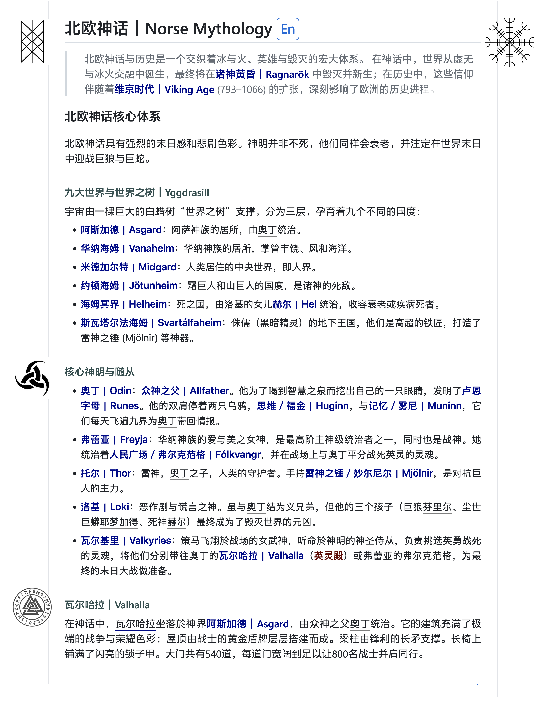
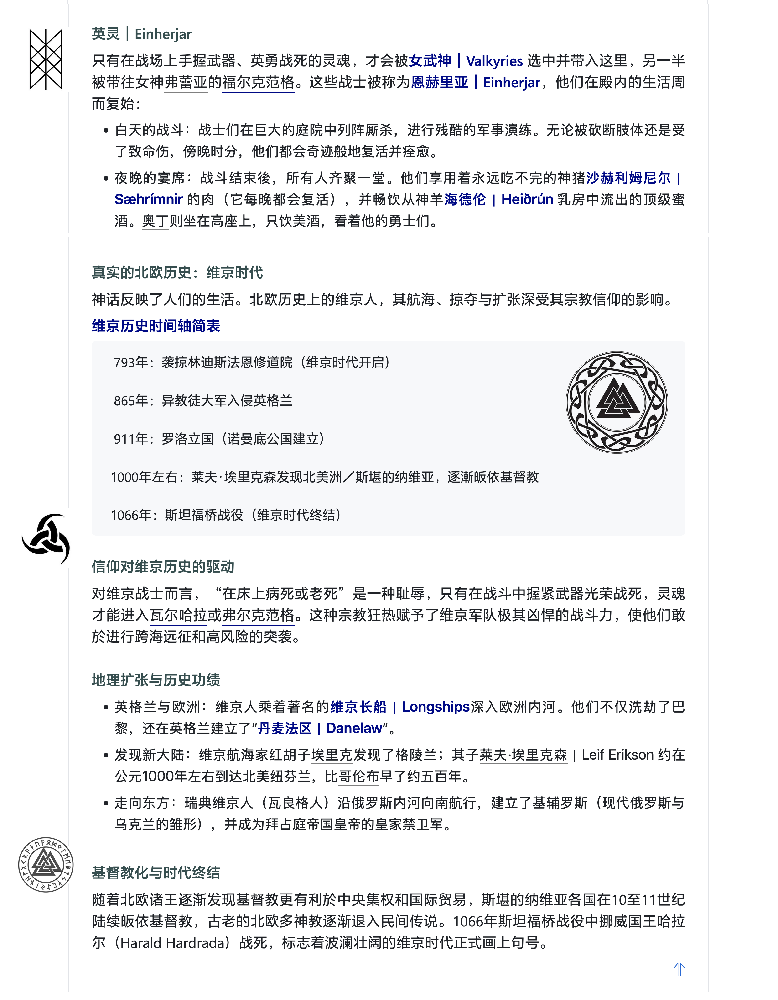
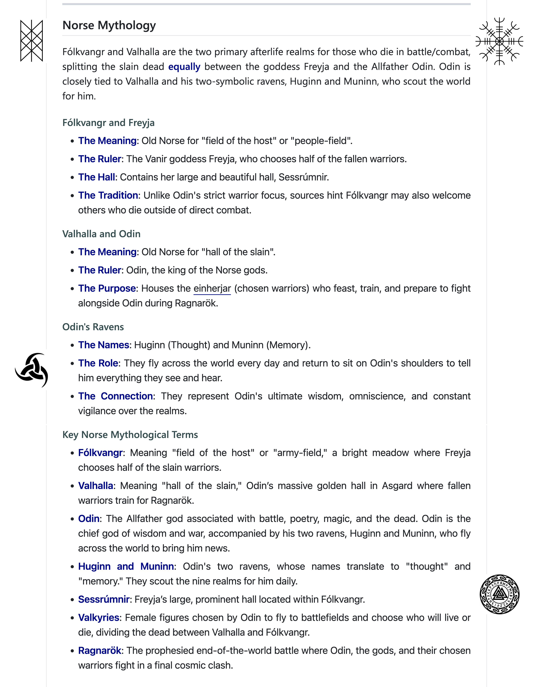

# 北欧神话｜Norse Mythology <a name="title"></a><a class="lang" href="#en">En</a>

> 北欧神话与历史是一个交织着冰与火、英雄与毁灭的宏大体系。 在神话中，世界从虚无与冰火交融中诞生，最终将在**诸神黄昏｜Ragnarök** 中毁灭并新生；在历史中，这些信仰伴随着**维京时代｜Viking Age** (793–1066) 的扩张，深刻影响了欧洲的历史进程。

## 北欧神话核心体系
北欧神话具有强烈的末日感和悲剧色彩。神明并非不死，他们同样会衰老，并注定在世界末日中迎战巨狼与巨蛇。

#### 九大世界与世界之树｜Yggdrasill

宇宙由一棵巨大的白蜡树“世界之树”支撑，分为三层，孕育着九个不同的国度：

* **阿斯加德｜Asgard**：阿萨神族的居所，由<u>奥丁</u>统治。
* **华纳海姆｜Vanaheim**：华纳神族的居所，掌管丰饶、风和海洋。
* **米德加尔特｜Midgard**：人类居住的中央世界，即人界。
* **约顿海姆｜Jötunheim**：霜巨人和山巨人的国度，是诸神的死敌。
* **海姆冥界｜Helheim**：死之国，由洛基的女儿**赫尔｜Hel** 统治，收容衰老或疾病死者。
* **斯瓦塔尔法海姆｜Svartálfaheim**：侏儒（黑暗精灵）的地下王国，他们是高超的铁匠，打造了雷神之锤 (Mjölnir) 等神器。

#### 核心神明与随从

* **奥丁｜Odin**：**众神之父｜Allfather**。他为了喝到智慧之泉而挖出自己的一只眼睛，发明了**卢恩字母｜Runes**。他的双肩停着两只乌鸦，**思维／福金｜Huginn**，与**记忆／雾尼｜Muninn**，它们每天飞遍九界为<u>奥丁</u>带回情报。
* **弗蕾亚｜Freyja**：华纳神族的爱与美之女神，是最高阶主神级统治者之一，同时也是战神。她统治着**人民广场／弗尔克范格｜Fólkvangr**，并在战场上与<u>奥丁</u>平分战死英灵的灵魂。
* **托尔｜Thor**：雷神，<u>奥丁</u>之子，人类的守护者。手持**雷神之锤／妙尔尼尔｜Mjölnir**，是对抗巨人的主力。
* **洛基｜Loki**：恶作剧与谎言之神。虽与<u>奥丁</u>结为义兄弟，但他的三个孩子（巨狼<u>芬里尔</u>、尘世巨蟒<u>耶梦加得</u>、死神<u>赫尔</u>）最终成为了毁灭世界的元凶。
* **瓦尔基里｜Valkyries**：策马飞翔於战场的女武神，听命於神明的神圣侍从，负责挑选英勇战死的灵魂，将他们分别带往<u>奥丁</u>的**瓦尔哈拉｜Valhalla**（<b>英灵殿</b>）或<u>弗蕾亚</u>的<em>弗尔克范格</em>，为最终的末日大战做准备。

#### 瓦尔哈拉｜Valhalla

在神话中，<em>瓦尔哈拉</em>坐落於神界**阿斯加德｜Asgard**，由众神之父<u>奥丁</u>统治。它的建筑充满了极端的战争与荣耀色彩：屋顶由战士的黄金盾牌层层搭建而成。梁柱由锋利的长矛支撑。长椅上铺满了闪亮的锁子甲。大门共有540道，每道门宽阔到足以让800名战士并肩同行。

#### 英灵｜Einherjar

只有在战场上手握武器、英勇战死的灵魂，才会被**女武神｜Valkyries** 选中并带入这里，另一半被带往女神<u>弗蕾亚</u>的<em>福尔克范格</em>。这些战士被称为**恩赫里亚｜Einherjar**，他们在殿内的生活周而复始：

* 白天的战斗：战士们在巨大的庭院中列阵厮杀，进行残酷的军事演练。无论被砍断肢体还是受了致命伤，傍晚时分，他们都会奇迹般地复活并痊愈。
* 夜晚的宴席：战斗结束後，所有人齐聚一堂。他们享用着永远吃不完的神猪**沙赫利姆尼尔｜Sæhrímnir** 的肉（它每晚都会复活），并畅饮从神羊**海德伦｜Heiðrún** 乳房中流出的顶级蜜酒。<u>奥丁</u>则坐在高座上，只饮美酒，看着他的勇士们。

### 真实的北欧历史：维京时代

神话反映了人们的生活。北欧历史上的维京人，其航海、掠夺与扩张深受其宗教信仰的影响。

**维京历史时间轴简表**

```
   793年：袭掠林迪斯法恩修道院（维京时代开启）
    │
   865年：异教徒大军入侵英格兰
    │
   911年：罗洛立国（诺曼底公国建立）
    │
  1000年左右：莱夫·埃里克森发现北美洲／斯堪的纳维亚，逐漸皈依基督教
    │
  1066年：斯坦福桥战役（维京时代终结）
```

#### 信仰对维京历史的驱动

对维京战士而言，“在床上病死或老死”是一种耻辱，只有在战斗中握紧武器光荣战死，灵魂才能进入<em>瓦尔哈拉</em>或<em>弗尔克范格</em>。这种宗教狂热赋予了维京军队极其凶悍的战斗力，使他们敢於进行跨海远征和高风险的突袭。

#### 地理扩张与历史功绩

* 英格兰与欧洲：维京人乘着著名的**维京长船｜Longships**深入欧洲内河。他们不仅洗劫了巴黎，还在英格兰建立了“**丹麦法区｜Danelaw**”。
* 发现新大陆：维京航海家红胡子<u>埃里克</u>发现了格陵兰；其子<u>莱夫·埃里克森</u>｜Leif Erikson 约在公元1000年左右到达北美纽芬兰，比<u>哥伦布</u>早了约五百年。
* 走向东方：瑞典维京人（瓦良格人）沿俄罗斯内河向南航行，建立了基辅罗斯（现代俄罗斯与乌克兰的雏形），并成为拜占庭帝国皇帝的皇家禁卫军。

#### 基督教化与时代终结

随着北欧诸王逐渐发现基督教更有利於中央集权和国际贸易，斯堪的纳维亚各国在10至11世纪陆续皈依基督教，古老的北欧多神教逐渐退入民间传说。1066年斯坦福桥战役中挪威国王哈拉尔（Harald Hardrada）战死，标志着波澜壮阔的维京时代正式画上句号。

<p class="up"><a href="#title">&uArr;</a><hr/></p>


## Norse Mythology <a name="en"></a>

Fólkvangr and Valhalla are the two primary afterlife realms for those who die in battle/combat, splitting the slain dead **equally** between the goddess Freyja and the Allfather Odin. Odin is closely tied to Valhalla and his two-symbolic ravens, Huginn and Muninn, who scout the world for him.

#### Fólkvangr and Freyja

* **The Meaning**: Old Norse for "field of the host" or "people-field".
* **The Ruler**: The Vanir goddess Freyja, who chooses half of the fallen warriors.
* **The Hall**: Contains her large and beautiful hall, Sessrúmnir.
* **The Tradition**: Unlike Odin's strict warrior focus, sources hint Fólkvangr may also welcome others who die outside of direct combat.

#### Valhalla and Odin

* **The Meaning**: Old Norse for "hall of the slain".
* **The Ruler**: Odin, the king of the Norse gods.
* **The Purpose**: Houses the _einherjar_ (chosen warriors) who feast, train, and prepare to fight alongside Odin during Ragnarök.

#### Odin's Ravens
* **The Names**: Huginn (Thought) and Muninn (Memory).
* **The Role**: They fly across the world every day and return to sit on Odin's shoulders to tell him everything they see and hear.
* **The Connection**: They represent Odin's ultimate wisdom, omniscience, and constant vigilance over the realms.


### Key Norse Mythological Terms

* **Fólkvangr**: Meaning "field of the host" or "army-field," a bright meadow where Freyja chooses half of the slain warriors.
* **Valhalla**: Meaning "hall of the slain," Odin’s massive golden hall in Asgard where fallen warriors train for Ragnarök.
* **Odin**: The Allfather god associated with battle, poetry, magic, and the dead. Odin is the chief god of wisdom and war, accompanied by his two ravens, Huginn and Muninn, who fly across the world to bring him news.
* **Huginn and Muninn**: Odin's two ravens, whose names translate to "thought" and "memory." They scout the nine realms for him daily.
* **Sessrúmnir**: Freyja’s large, prominent hall located within Fólkvangr.
* **Valkyries**: Female figures chosen by Odin to fly to battlefields and choose who will live or die, dividing the dead between Valhalla and Fólkvangr.
* **Ragnarök**: The prophesied end-of-the-world battle where Odin, the gods, and their chosen warriors fight in a final cosmic clash.

<p class="up"><a href="#title">&uArr;</a><hr/></p>

### Download pages

<a href="images/norse-c1.png" title="Page 1"
    target="_blank">
<a href="images/norse-c2.png" title="Page 2"
    target="_blank">
<a href="images/norse-en.png" title="Page 3"
    target="_blank">

&raquo; Back to <a href="#title">Content Title</a> | [Home](../README.md)

<!--stylesheet-->
<div style="display:none">
<style type="text/css"><!--
a.lang {
  border: solid 1px;
  border-radius: 0.25em;
  padding: 0.1em 0.35em 0.15em 0.25em;
  font-size: smaller;
}
a:hover {
  color: darkred !important;
  text-decoration: none !important;
  background-color: lightyellow;
}
b,strong {
  color: darkblue;
}
body,h1,h2,h3,h4,h5,p,pre,code {
  font-family: "Microsoft YaHei", "STHeiti", "Heiti SC", "PingFang SC", "微软雅黑", "黑体", "华文细黑", "Hiragino Sans GB", "Helvetica Neue", "Sarasa Gothic", "Source Code Pro", "Helvetica", "Verdana", sans-serif !important;
  line-height: 1.5em;
}
body,h1,h2 {
  font-size: 1.5em;
}
h3,h4,h5 {
  color: darkslategray;
  font-size: 1.25em !important;
  line-height: 1.25em;
  margin: 2em 0em 0.5em 0 !important;
  text-indent: 0em;
}
img.third {
  margin: 0; padding: 0;
  width: 31%;
}
pre>code {
  font-size: 1.25em !important;
}
p,li {
  font-size: 1.05em !important;
  margin: 0em 0em 0.35em !important;
  text-align: justify;
}
p.up {
  text-align: right;
}
blockquote p {
  margin-left: 0.95em !important;
  text-align: justify;
  text-indent: 0em;
}
blockquote p>br {
  display: block !important;
}
b {
  color: #660000; /* or darkred; */
  border-bottom: solid 0.075em darkred;
  font-style: normal;
  padding-bottom: 0.05em;
  text-decoration: none;
}
em {
  font-style: normal;
  border-bottom: solid 0.075em darkblue;
  padding-bottom: 0.05em;
  text-decoration: none;
}
u {
  border-bottom: solid 0.075em gray;
  padding-bottom: 0.05em;
  text-decoration: none;
}
@media print {
  body,div,div#_html,p,code,pre {
    font-family: "Microsoft YaHei", "STHeiti", "Heiti SC", "PingFang SC", "微软雅黑", "黑体", "华文细黑", "Hiragino Sans GB", "Helvetica Neue", "Sarasa Gothic", "Source Code Pro", "Helvetica", "Verdana", sans-serif !important;
  }
  div#anchor {
    display: none;
  }
}
--></style>
</div>
